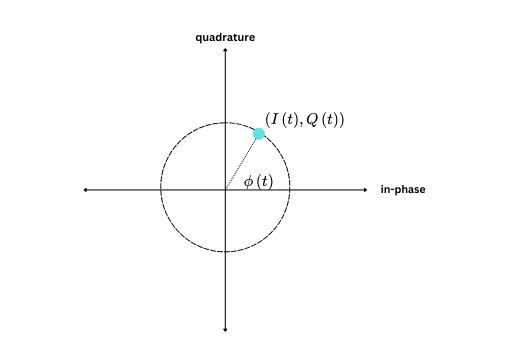
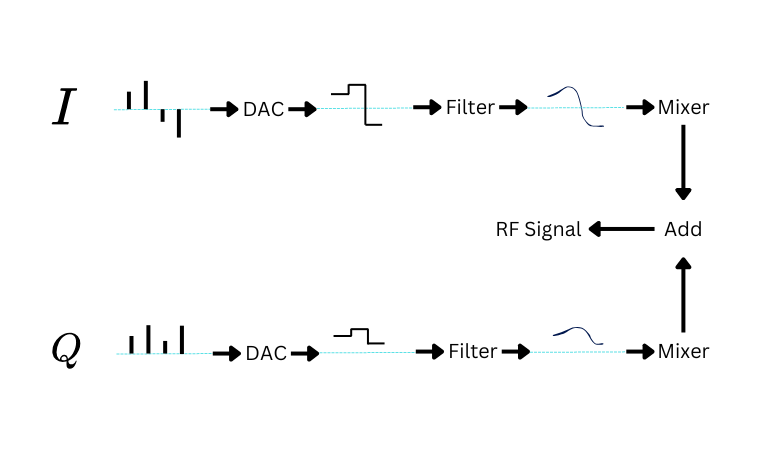
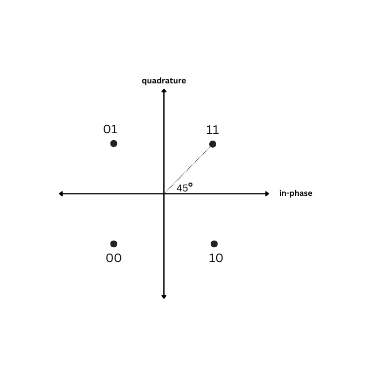

In this post, we're going to go through the early stages of building a digital **Quadrature Phase Shift Keying** (QPSK) modulator.  A modulator is one of the most critical pieces of a communucation system.  It's the device responsible for taking the data you want to transmit, and using it to modify a characteristic of a high carrier frequency signal.  Usually the phase, frequency, or amplitude.  Without modulators, the ease and reliability of long distance communications would be impossible.   

We'll start with a little history, and a little math. After that, we'll get into the nuts-and-bolts of how it all works.  The code I'll present and explain later on is the same type of code I write in actual design simulations.

## Background and Motivation

Before transistors, communications was depended on analog technology.  Modems were built by slide-rule wielding engineers with a magical ability to control voltages and currents on complicated circuit boards.     

The proliferation of integrated circuits in the 1960's shook up the electronics industry.  Engineers started thinking about how they could take advantage of this new digital paradigm to improve existing product , or maybe invent something completely new.          

**Phase Shift Keying** (PSK) is a great example of this change in mindset.  PSK is very popular digital modulation technique based on "digitizing" analog phase modulation.  Good phase modulation systems are difficult to design and are not common.  This is probably why you've heard of AM radio (amplitude modulation), FM radio (frequency modulation), but not PM radio. 

In classical analog phase modulation, information is encoded in the phase of a high frequency, radio frequency (RF) carrier signal using special circuitry.  The encoding process is designed into the circuit, and it happens in continuous time.  

In modern PSK, the information used to modulate the carrier is synthesized in programs that run on microprocessors.  The programs produce sequences of precisely timed voltage pulses that are converted to an analog signals using widely available, inexpensive, and easy to use hardware components.  Analog circuitry is still crucial, it just isn't where most of the secret sauce is. 

Even though PSK and phase modulation are engineered in different ways, the underlying mathematical principles are the same.  We'll see this in the next few sections.     

## Phase Shift Keying and I/Q Modulation

If you crack open a communications book, you'll probably see phase modulation described like this

$$
y(t) = \cos(2\pi f t + \phi (t)).
$$

* $f$ is freqency in Hz (aka cycles per second).
* $t$ is time in seconds.
* $\phi(t)$ is the continuous time phase shift that encodes information.

The problem with the equation is that the waveform we'd like to digitize, $\phi(t)$, and the higher frequency carrier that we'd like to keep as analog, are jumbled together.  We need to find a way to rip them apart.

Fortunately, you only need some high school math!  Do you remember those angle sum formulas from trig or precalculus?  Let's take the angle sum formula for $\cos$:

$$
\cos(x+y) = \cos(x)\cos(y) - \sin(x)\sin(y)
$$

and apply it to $y(t)$.  Here's the result:

$$
y(t) = \cos (\phi (t))  \cos(2\pi f t) - \sin(\phi (t)) \sin(2\pi f t)
$$

Let's clean it up by substituting $I(t)$ (the in-phase signal) for $\cos (\phi (t))$ and $Q(t)$ (the quadrature signal) for $\sin(\phi (t))$:

$$
y(t) = I(t)  \cos(2\pi f t) - Q(t) \sin(2\pi f t)
$$

The substitution converts phase angles to points on the unit circle:



This is called **I/Q-modulation**, and is the key to understanding how PSK works.  Here's an overview showing one possible architecture:



The digital part of the modulator produces two pulse sequences: one for $I$ and one for $Q$.  Together, the I/Q pulse pairs are called **symbols**.  Each sequence is sent through two digital-to-analog converters (DAC) that transform pulses to continuous, non-smooth, analog signals.  These jaggedy signals are smoothed out with a pair of analog reconstruction filters.  Finally, the smooth analog signals are frequency translated to a higher RF frequency with a pair of mixers, and combined together.  

All the information is in the symbols.  This means that the speed that the symbols are getting written to the DACs is the speed of communication.  The higher the speed, the more bandwidth your final signal will occupy.

## QPSK

QPSK, is a specific type of PSK that uses 4 distict phase shifts : $45^\circ$, $135^\circ$, $225^\circ$, and $315^\circ$. The phase shifts get mapped to 4 points on the unit circle.  Each 
point is usually called a **symbol** and is represented by 2 bits.  

The $XY$ plane with the plotten symbols forms the **constellation diagram**.  Here's an example of a constellation diagram showing one way to map bits to symbols.  




## Programming Style

Python is my preferred language for writing simulations. It's simple, has decent performance as long as you use the right libraries, and doesn't require a lot of ceremony. You can just open up a text file and hack away.

Unlike some numerical-focused scripting languages I've used before (like Matlab or Julia), efficient arrays aren't built in. You need to import them through third-party libraries. This leads to some clunky syntax, but you get used to it. In my opinion, the benefits of using Python outweigh the occasional annoyance.

I like my modem simulations to be simple. No fancy programming-language magic or crazy abstractions allowed. Ultimately, I want to take my Python simulation and convert it to a hardware description language (Verilog/System Verilog) or low-level programming language (C), without thinking too hard. So if you look at my code and wonder why I don't use a certain language feature, that's why.

## Modulator Simulation

The three packages I rely on most heavily are

1.  `numpy` for efficient arrays and math,
2.  `matplotlib` for plotting
3.  `scipy` for filter design

For this first post we can get away without using `scipy`. 

To kick things off, let's import the packages:

``` python
import numpy as np 
import matplotlib.pyplot as plt   
```

### From byte arrays to complex QPSK symbols

Now we need to select a payload.  A payload is the application specific data you want to send to the receiver. It could be sensor data, text, pretty much anything. Unless I have a compelling reason not to, I like my simulated payloads to be English phrases. It makes debugging easier. I'm a big fan of using "hex-speak", which is a little language built by expressing unsigned integers in hexadecimal. Most of them are pretty funny, and just lighten the mood. Here are a few of my favorites: `0xDEADBEEF`, `0xFEEDBABE`, `0xDECAFBAD`, `0xBADF00D`. Let's combine them into one big hex-speak phrase and partition them into bytes:

``` python
payload = [
    0xDE, 0xAD, 0xBE, 0xEF, # DEADBEEF
    0xFE, 0xED, 0xBA, 0xBE, # FEEDBABE
    0xDE, 0xCA, 0xFB, 0xAD, # DECAFBAD
    0xBA, 0xAD, 0xF0, 0x0D  # BAADF00D
]
```

#### Bytes to Bits

Now that we have the payload, we can start progressively moving toward building the symbols. First, we need to convert the byte array to a bit array. This boils down to extracting the 8 bits from each byte, and concatenating them all together. There are several ways to do this in Python. Here's the version that most closely follows what you might do in a language like C.

``` python
num_chars = len(payload)
num_bits = num_chars * 8
payload_bits = np.zeros(num_bits)
k = 0
for i in range(num_chars):
    byte = payload[i]
    for j in range(8):
        payload_bits[k] = 1 & (byte >> j)
        k += 1
```

#### Bits to Symbols

Converting bits to symbols is pretty simple. Start by splitting the bit array in half. Half the bits will be used for the in-phase signal and the other half will be used for the quadrature signal. As long as you use the same splitting method in the receiver, you can do this however you want. I always split the bits based on whether the bit index is even or odd. The even bits become the in-phase bits and the odd bits become the quadrature bits:

``` python
i_bits = payload_bits[0::2]
q_bits = payload_bits[1::2]
```

Next, take a  bit from each array, and map the bit pair to a point in the $XY$ plane. Here's one way to do this that takes advantage of `numpy`'s vectorization capabilities.

``` python
i_symbols = 2 * i_bits - 1
q_symbols = 2 * q_bits - 1

iq_symbols = i_symbols + 1j * q_symbols
```

### Pulse Shaping Filter

Now that we've converted the payload to an array of symbols, it's time to start building the baseband waveform. This requires a pulse-shaping filter.  A pulse shaping filter is a special type of digital **finite inpulse response** (FIR) filter that smooths out the symbol pulses.  Selecting the wrong filter, or none at all, will likely result in your system radiating way too much energy in frequency bands you don't expect.  Worse case, nearby electronic devices could go on the fritz and fail.  You always want to constrain your bandwidth.  Effective filtering helps do this.  

The most common pulse-shaping filter is the **root-raised cosine filter**. My hand-rolled, battle tested version (shown below), is not the prettiest code I've ever written, but it works.

``` python
def root_raised_cosine(
    rate_i=1,       # Input sample rate (always set to 1)
    rate_o=16,      # Ouput sample rate (interpolation factor)
    beta=0.5,       # Excess bandwidth parameter (between 0 and 1)
    delay=5         # Number of symbol periods it takes for the peak to occur
):

    samples_per_symbol = rate_o // rate_i 

    n = int(samples_per_symbol * delay)
    x = []

    # Add first element
    x = x + [1 + beta * ((4/np.pi) - 1)]
    for i in range(1,n+1):
        if i == (samples_per_symbol/(4*beta)):
            sin_ = np.sin(np.pi/(4*beta))
            cos_ = np.cos(np.pi/(4*beta))
            c1  = (beta / np.sqrt(2))
            c2  = 1+(2/np.pi)
            c3  = 1-(2/np.pi)
            xi  = c1 * ((c2 * sin_) + (c3 * cos_))
        else:
            sin_ = np.sin(np.pi * i * (1-beta) / samples_per_symbol)
            cos_ = np.cos(np.pi * i * (1+beta) /samples_per_symbol)
            c1  = 4 * beta * i / samples_per_symbol 
            c2  = np.pi * (i / samples_per_symbol) * (1 - c1**2)  
            xi  = (sin_ + (c1 * cos_)) / c2

        x = [xi] + x + [xi]


    return np.array(x)
```

Okay, let's say we want to communicate at a rate of 1000 symbols per second and interpolate by 16 times. We'll keep `rate_i` at 1 and change `rate_o` to 16.  The ratio of `rate_o` to `rate_i` should equal the amount we want to interpolate by.

-   `delay` controls how many symbol periods you want the filter to last. I usually keep it set to 5.
-   `beta` gives you fine-grained control of the bandwidth of the signal. In my experience, this is usually set to 0.25 or 0.5.  The higher the value, the higher the bandwidth.

Here's how we create the shaping filter for this scenario:

``` python
shaping_filter = root_raised_cosine(rate_o=16, rate_i=1, beta=0.5, delay=5)
```

and here's what the filter looks like as a function of symbol period. This is also called the filter's **impulse response**. There are 10 symbol periods because `delay` is set to 5.  The number of symbol periods is always twice the `delay`.

``` python
plt.figure(1)
inds = np.linspace(-5, +5, len(shaping_filter))
plt.plot(inds, shaping_filter)
plt.xlim([-5, 5])
plt.xticks(np.arange(-5, +6))
plt.xlabel("Symbol Period")
plt.ylabel("Amplitude")
plt.grid()
```



### Interpolation Strategies 

Now that we have the pulse-shaping filter, it's time to use it to smoothly interpolate the symbols. 
There's an inefficient, easy way, to do this and an efficient, more complex way to do this. Let's start with the easy way.

#### Straight Convolution - The Easy Way

For the easy way, we upsample the symbol array by a factor of 16 and apply the filter using `numpy`'s convolution function:

``` python
num_symbols = len(iq_symbols)
iq_symbols_upsampled = np.zeros(num_symbols * 16, dtype=complex)
iq_symbols_upsampled[::16] = iq_symbols

baseband_waveform = np.convolve(iq_symbols_upsampled, shaping_filter)
```

Think of convolution as a walking multiply and accumulator. The filter walks across the input one sample at a time, point-wise multiplies the filter coefficients with a segment of the filter input input coefficients, and adds the results.

To plot the output with respect to time, we need to calculate the number of samples per second (aka sample rate) with a unit conversion:
$$ 
\frac{\text{samples}}{\text{second}} = \frac{\text{samples}}{\text{symbol}} \times \frac{\text{symbols}}{\text{second}}
$$

Here's the accompanying code:

``` python
samples_per_symbol = 16
symbols_per_second = 1000
samples_per_second = samples_per_symbol * symbols_per_second
```

Here's what the final baseband waveform looks like:

``` python
num_baseband_samples = len(baseband_waveform)
t_ms = 1000*np.arange(num_baseband_samples) / samples_per_second
plt.plot(t_ms, np.real(baseband_waveform), label="I")
plt.plot(t_ms, np.imag(baseband_waveform), label="Q")
plt.xlabel("Time (ms)")
plt.ylabel("Amplitude")
plt.legend()
```



Remember how I said this was inefficient?  Can you see why?  Upsampling distributes the samples over a large array full of zeros. Unfortunately, the convolution function doesn't know anything about this. It's going to do what it normally does (which is multiply and accumulate), even if most of the entries are 0. This is a huge waste of time and energy. If we know for a fact that an element in an array is 0, we should just skip over it.

#### Multirate Signal Processing - The Hard Way

This brings us to the harder, but more efficient way of doing the interpolation.   It's based on an important signal processing technique called **multirate signal processing**. There's no way to do this justice in one blog post. Instead, I'll give some motivation and some code to demonstrate the process.  If you're interested in learning more about it, here's a list of some authoritative books:

* [Multirate Signal Processing for Communications Systems - Fredric J Harris](https://www.amazon.com/Multirate-Processing-Communication-Systems-Publishers/dp/877022210X/ref=asc_df_877022210X/?tag=hyprod-20&linkCode=df0&hvadid=693296405172&hvpos=&hvnetw=g&hvrand=4559866533785259274&hvpone=&hvptwo=&hvqmt=&hvdev=c&hvdvcmdl=&hvlocint=&hvlocphy=9192171&hvtargid=pla-1161835612443&psc=1&mcid=08126222a4593f0dac4cbeedbdc04b2d&tag=hyprod-20&linkCode=df0&hvadid=693296405172&hvpos=&hvnetw=g&hvrand=4559866533785259274&hvpone=&hvptwo=&hvqmt=&hvdev=c&hvdvcmdl=&hvlocint=&hvlocphy=9192171&hvtargid=pla-1161835612443&psc=1 "target=_blank")
* Multirate Signal Processing - Ronald Crochiere and Lawrence Rabiner
* Multirate Systems and Filter Banks - P.P Vaidyanathan
* Wavelets and Filter Banks - Gilbert Strang and Truong Nguyen

Mulirate signal processing is all about restructuring a workload to improve
computational efficiency. On a powerful processor, this might not matter. But if you're system needs to run in real-time, on resource constrained hardware, processing overhead becomes a concern.

To apply multirate signal processing to our pulse-shaping task, transform the 161 element, single dimensional array into a two-dimensional *filter bank* consisting of 16 rows and 11 columns. Yes, the number of rows must match the number of samples per symbol.

``` python
filter_bank = np.reshape(
    np.concatenate((shaping_filter, np.zeros(15))),
    (16, 11),
    order="F"        
)
```

Tacking on 15 zeros at the end of the shaping filter makes the reshaping workout.  The filter bank is applied to the input using a custom algorithm. No upsampling required.

``` python
iq_symbols_1 = np.concatenate((iq_symbols, np.zeros(16)))
buffer = np.zeros(11, dtype=complex)
baseband_samples_fb = np.zeros(len(iq_symbols_1) * samples_per_symbol, dtype=complex)
k = 0
for i in range(len(iq_symbols_1)):
    buffer[10] = buffer[9]
    buffer[ 9] = buffer[8]
    buffer[ 8] = buffer[7]
    buffer[ 7] = buffer[6]
    buffer[ 6] = buffer[5]
    buffer[ 5] = buffer[4]
    buffer[ 4] = buffer[3]
    buffer[ 3] = buffer[2]
    buffer[ 2] = buffer[1]
    buffer[ 1] = buffer[0]
    buffer[ 0] = iq_symbols_1[i]

    for index in range(samples_per_symbol):
        baseband_samples_fb[k+index] = np.sum(buffer * filter_bank[index,:])

    k += 16
```

The workload improvements are pretty incredible:

-   Easy way: ~300 multiplies and additions for a single output sample.
-   Hard way: ~20 multiples and additions for a single output sample.

Not bad right? The only price you pay is a more complex implementation. When you
get used to how multirate signal processing works though, it it's not too bad.

And here's what the in-phase and quadrature signals look like when we use multirate
processing.

``` python
num_baseband_samples_fb = len(baseband_samples_fb)
t_ms = 1000*np.arange(num_baseband_samples_fb) / samples_per_second
plt.plot(t_ms, np.real(baseband_samples_fb), label="I")
plt.plot(t_ms, np.imag(baseband_samples_fb), label="Q")
plt.xlabel("Time (ms)")
plt.ylabel("Amplitude")
plt.legend()
```



Besides having a few more samples, the results are exactly the same.

### Modulation Validation

At this point, it's worth asking 

> "yeah, but how do you know this is correct?"

Great question😊!

My inadaquate answer is

> "I can tell by how the waveform looks".

I'll give a better answer next time.

## Conclusion

If you read until the end, thank you. This was much longer than I originally intended, but there was a lot to cover:

1.  We went through some math that described how QPSK modulation works
2.  Described how to go from a digital payload represented as an array of bytes to an array of QPSK symbols.
3.  Discussed pulse shaping filters.
4.  Touched on the benefits of multirate signal processing.

Next time, I'll explain how to prove that the baseband waveform does properly encode the payload.
