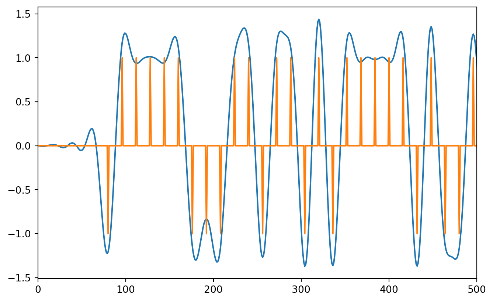
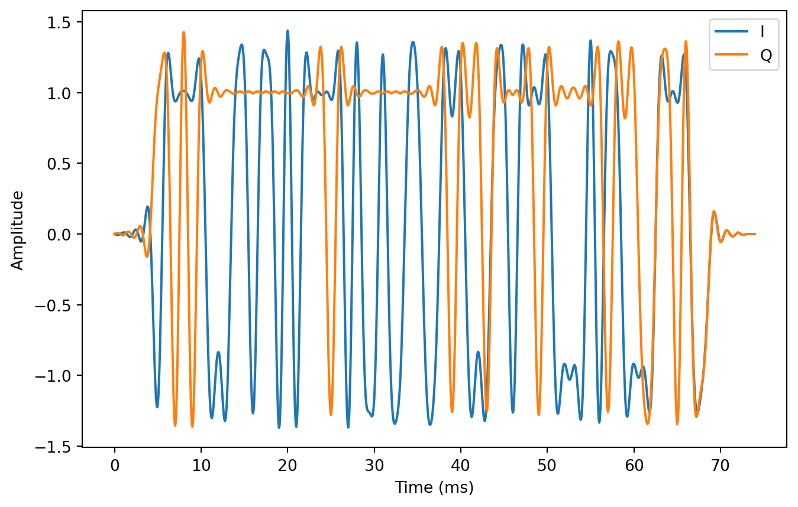
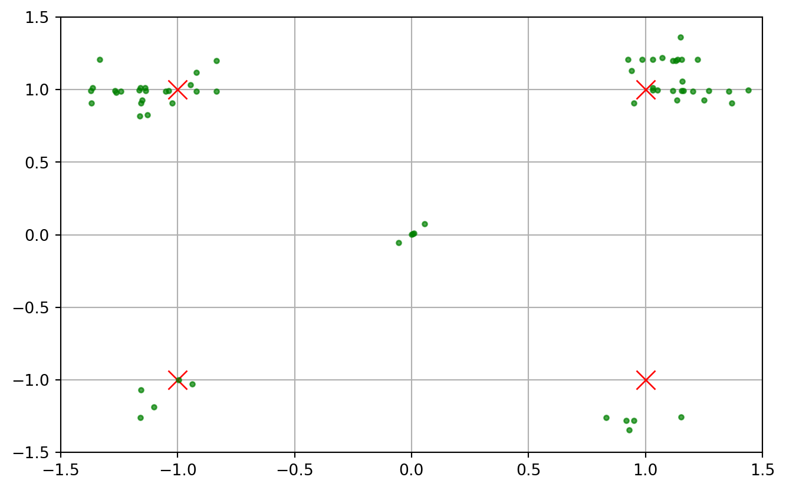

*Quadrature Phase Shift Keying*, or QPSK for short, is a digital modulation technique that encodes information in a high frequency carrier signal by introducing phase shifts of $45^\circ$, $135^\circ$, $225^\circ$, or $315^\circ$ at a specified *symbol rate*. Each phase shift is called a *symbol*. For QPSK, a symbol is represented by 2 bits. Higher order Quadrature Amplitude Modulation (QAM) schemes use more bits per symbol.

Phase shift keying (PSK) is the discrete time version of analog phase modulation. Analog modulation predates the invention of integrated circuits, even transistors. Analog modulators are built out of discrete components and tend to be simpler and consume less power than their digital counterparts. However, digital modulators are programmed with processors, making them far more flexible and precise.

## Derivation

The equation for phase modulating a carrier sitting at $f$ Hz with an information bearing baseband signal $\phi (t)$ is

$$
  y(t) = \cos(2\pi f t + \phi (t)).
$$

Turns out that this isn't a very helpful expression for developing a QPSK modulator because the carrier and baseband signals are intertwined. If we can rip them apart, the baseband signal can be synthesized digitally and converted to an analog waveform at transmission time, using common and inexpensive circuit components.

Fortunately, the fix is simple. All we need is one of the angle sum formulas you probably learned in highschool:

$$
  \cos(x+y) = \cos(x)\cos(y) - \sin(x)\sin(y)
$$

If we apply this to $y(t)$, we get

$$
  y(t) = \cos (\phi (t))  \cos(2\pi f t) - \sin(\phi (t)) \sin(2\pi f t)
$$

I don't like all the parenthesis. To clean it up, let's express this in terms of "I/Q modulation":

$$
  y(t) = I(t)  \cos(2\pi f t) - Q(t) \sin(2\pi f t)
$$

where $I(t)$ and $Q(t)$ are the so-called in-phase and quadrature signals. These signals pop up frequently in digital communications, and in our particular case

$$
    I(t) = \cos (\phi (t)) \text{ and } Q(t) = \sin(\phi(t)).
$$

### What's the Point?

@TODO: talk about analog stuff, summarize

## Programming Style

Before we get started on the modulator, I want to comment on my programming style. I like my modem simulations to be as simple as possible. No fancy programming-language magic or crazy abstractions allowed. Eventually, I want to take my simulation code and easily convert it into a hardware description language (Verilog/System Verilog) or low-level programming language (C), without thinking too hard. So if you look at my code and wonder why I didn't use a certain language feature, that's why.

## My Preferred Toolchain

Python is my preferred language for writing modem simulations. It's simple, has decent performance as long as you use the right libraries, and doesn't require a lot of ceremony. You can just open up a text file and hack away. Unlike some numerical-focused scripting languages I've used (Matlab and Julia), efficient arrays aren't built into the language. They need to be accessed through third-party, open source, packages. This leads to some clunky syntax, but you get used to it. In my opinion, the benefits of using Python outweigh annoying syntax.

## Modulator Simulation

@TODO: Add diagram with large workflow, channel encoding, preamble, etc.

The two packages you absolutely need to write effective simulations in Python are `numpy` (for efficient arrays and math), and `matplotlib` (for plotting). Eventually, we'll also want to use import `scipy`. To kick things off, let's import them.

``` python
import numpy as np 
import matplotlib.pyplot as plt   
```

### From byte arrays to complex QPSK symbols

Let's select a payload. In a real system, the payload is the application specific data you want to send to the receiver. Unless I have a compelling reason not to, I like my simulated payloads to be English phrases. It makes debugging easier. I'm a big fan of using "hex-speak" for this sort of thing. Hex-speak numbers are groups of unsigned integers that also spell out words or phrases when expressed in hexadecimal (aka base 16 numbers). Most of them are pretty funny, and just lighten the mood. Here are a few of my favorites: `0xDEADBEEF`, `0xFEEDBABE`, `0xDECAFBAD`, `0xBADF00D`. Let's combine them into one big hex-speak phrase and partition them into bytes:

``` python
payload = [
    0xDE, 0xAD, 0xBE, 0xEF, # DEADBEEF
    0xFE, 0xED, 0xBA, 0xBE, # FEEDBABE
    0xDE, 0xCA, 0xFB, 0xAD, # DECAFBAD
    0xBA, 0xAD, 0xF0, 0x0D  # BAADF00D
]
```

#### Bytes to Bits

Now that we have the payload, we can start progressively moving toward getting symbols. First, we need to convert the byte array to a bit array. This boils down to extracting the 8 bits from each byte, and concatenating them all together. There are several ways to implement this in Python. Here's the version that most closely follows what you might do in a language like C.

``` python
num_chars = len(payload)
num_bits = num_chars * 8
payload_bits = np.zeros(num_bits)
k = 0
for i in range(num_chars):
    byte = payload[i]
    for j in range(8):
        payload_bits[k] = 1 & (byte >> j)
        k += 1
```

#### Bits to Symbols

Converting bits to symbols is pretty simple. The first thing we need to do is split the bit array in half. Half the bits will be used for the in-phase signal and the other half will be used for the quadrature signal. As long as you use the same splitting method in the receiver, you can do this however you want. I always split the bits based on whether the bit index is even or odd. The even bits become the in-phase bits and the odd bits become the quadrature bits:

``` python
i_bits = payload_bits[0::2]
q_bits = payload_bits[1::2]
```

Because the payload has an even number of bits, the lengths of `i_bits` and `q_bits` are the same. This means we can take a bit from each array, and map the bit pair to a point in the `XY`-plane. Here's one way to do this that takes advantage of `numpy`'s vectorization capabilities.

``` python
i_symbols = 2 * i_bits - 1
q_symbols = 2 * q_bits - 1

iq_symbols = i_symbols + 1j * q_symbols
```

### Pulse Shaping

Now that we've converted the payload to an array of symbols, it's time to start
building up our baseband waveform by selecting a suitable pulse-shaping filter.
To build the right filter we need to ask ourselves a couple of questions:

1.  How rapidly do we need to communicate?
2.  How rapidly are we sending digital samples to the D/A converter?

The answer to these two questions have a huge impact on the complexity of your modem. We need to walk before we can run, so let's keep it simple. We're going to assume that out D/A converter is expecting digital samples at a rate of 16 thousand samples per second (aka 16kHz) and we need to communicate at a rate of 1000 symbols per second. If you do the division, this means that the baseband waveform will have

$$
    \frac{16000\text{ samples/sec }}{1000 \text{ symbols/sec }} = 16\text{ samples/symbol }
$$

Pulse shaping uses a very specific type of digital filter to interpolate the symbols into a smoother complex waveform.

We'll discuss filter variations and their tradeoffs in a later post. For now, let's just use the most common one: the **root-raised cosine filter**. Here's an implementation I've used for several projects. It's not pretty, but it gets the job done.

``` python
def root_raised_cosine(
    rate_i=1,       # Input sample rate
    rate_o=16,      # Ouput sample rate
    beta=0.5,       # Excess bandwidth parameter
    delay=5         # Number of symbol periods it takes for the peak to occur
):

    samples_per_symbol = rate_o // rate_i 

    n = int(samples_per_symbol * delay)
    x = []

    # Add first element
    x = x + [1 + beta * ((4/np.pi) - 1)]
    for i in range(1,n+1):
        if i == (samples_per_symbol/(4*beta)):
            sin_ = np.sin(np.pi/(4*beta))
            cos_ = np.cos(np.pi/(4*beta))
            c1  = (beta / np.sqrt(2))
            c2  = 1+(2/np.pi)
            c3  = 1-(2/np.pi)
            xi  = c1 * ((c2 * sin_) + (c3 * cos_))
        else:
            sin_ = np.sin(np.pi * i * (1-beta) / samples_per_symbol)
            cos_ = np.cos(np.pi * i * (1+beta) /samples_per_symbol)
            c1  = 4 * beta * i / samples_per_symbol 
            c2  = np.pi * (i / samples_per_symbol) * (1 - c1**2)  
            xi  = (sin_ + (c1 * cos_)) / c2

        x = [xi] + x + [xi]


    return np.array(x)
```

Look at all that math. There are a lot of ways I could have screwed this function up.

As the first line in the function body suggests, the ratio of the output and input sample rates gives you the number of

### Validate the Basband Modulator

``` python
iq_symbols_1 = np.zeros(16 * len(iq_symbols), dtype=complex)
iq_symbols_1[::16] = iq_symbols
```

``` python
matched_filter = root_raised_cosine(1, 16, 0.5, 5)
delay = (len(matched_filter)-1)//2
```

``` python
x0 = np.convolve(iq_symbols_1, matched_filter)
```

``` python
plt.plot(np.real(x0))
plt.plot(np.concatenate((np.zeros(delay),np.real(iq_symbols_1))))
plt.xlim([0, 500])
```



``` python
x1 = np.convolve(x0, matched_filter/np.sum(matched_filter*matched_filter))

start = 2*delay
x2 = x0[start::16]
plt.plot(np.real(x1))
plt.plot(np.imag(x1))
plt.grid()
```



A constellation is just a scatter plot of the complex symbols. The in-phase part of each symbol goes on the horizontal axis and the quadrature-part goes on the vertical axis.

``` python
plt.figure(1)
plt.plot(+1, +1, "rx", markersize=12)
plt.plot(-1, +1, "rx", markersize=12)
plt.plot(-1, -1, "rx", markersize=12)
plt.plot(+1, -1, "rx", markersize=12)
plt.plot(np.real(x2), np.imag(x2), "g.", alpha=0.7)


plt.xlim([-1.5, +1.5])
plt.ylim([-1.5, +1.5])
plt.grid()
```



The constellation diagram for the ideal symbols, is extremely boring. It's extremely useful for receiver development though. When noise starts getting added to the signals, the small green circles get larger and more diffuse.
\### Frequency translation

## Conclusion
