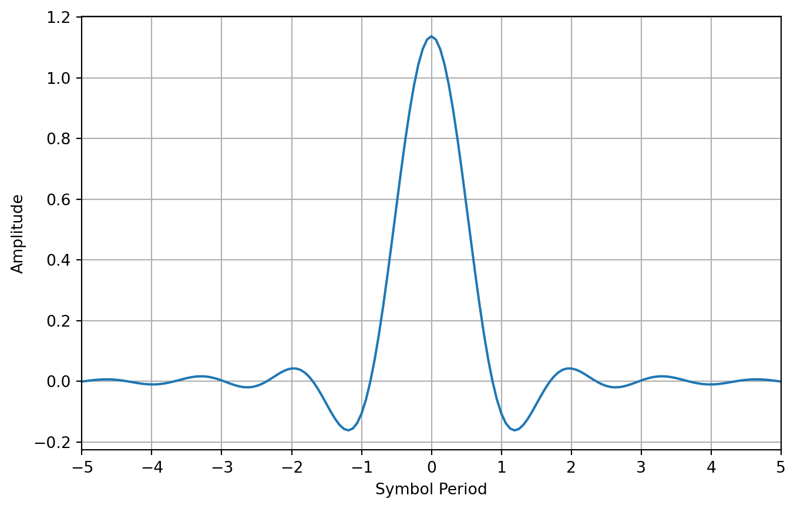
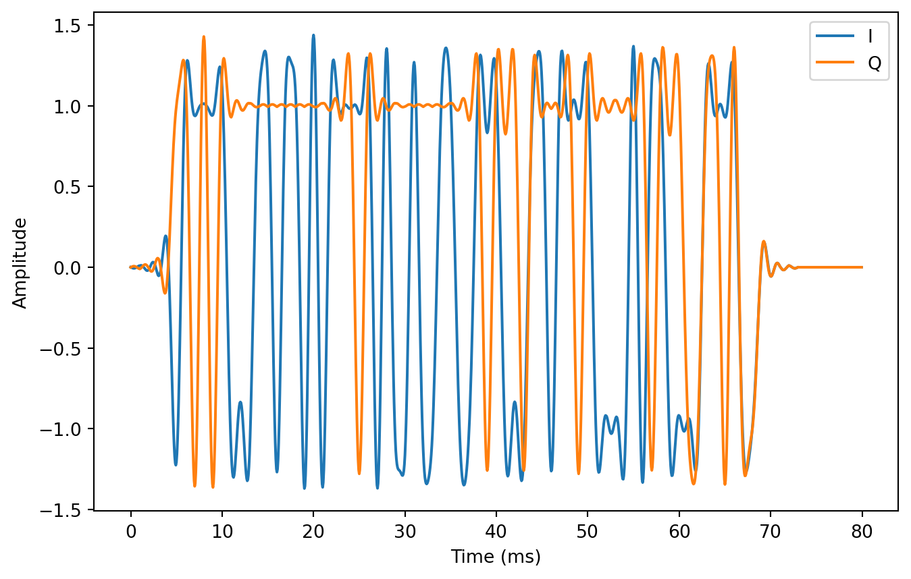
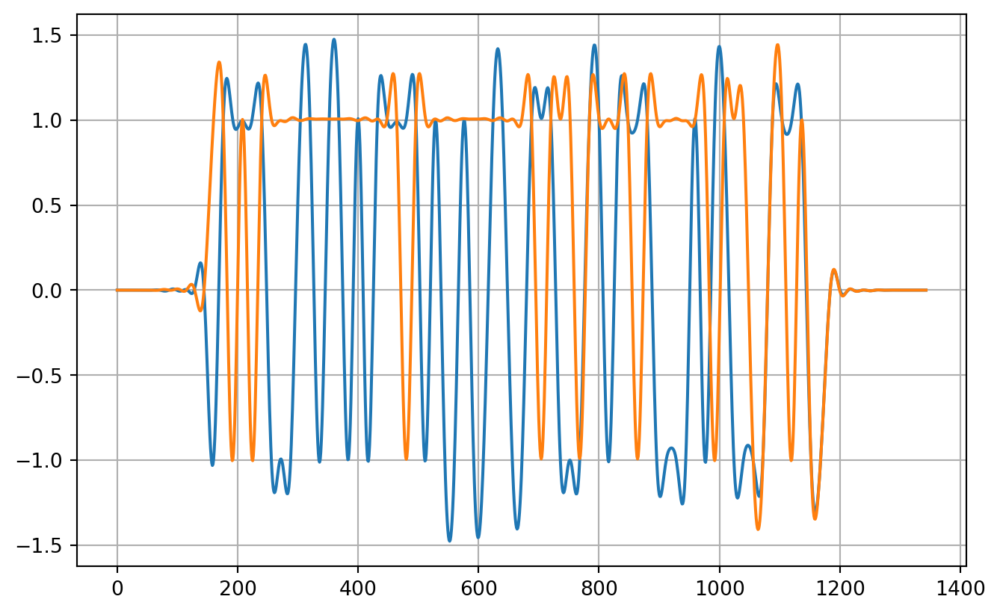

*Quadrature Phase Shift Keying*, or QPSK for short, is a digital modulation technique that encodes information onto carrier wave by introducing phase shifts of $45^\circ$, $135^\circ$, $225^\circ$, or $315^\circ$ at a specified *symbol rate*. Each phase shift is called a *symbol*. For QPSK, a symbol is represented by 2 bits. Higher order Quadrature Amplitude Modulation (QAM) schemes use more bits per symbol.

Phase shift keying (PSK) is the discrete time version of analog phase modulation. Analog modulation predates the invention of integrated circuits, even transistors. Analog modulators are built out of discrete components and tend to be simpler and consume less power than their digital counterparts. However, digital modulators are programmed with processors, making them far more flexible and precise.

## Derivation

The equation for phase modulating a carrier sitting at $f$ Hz with an information bearing baseband signal $\phi (t)$ is

$$
  y(t) = \cos(2\pi f t + \phi (t)).
$$

Turns out that this isn't a very helpful expression for developing a QPSK modulator because the carrier and baseband signals are intertwined. If we can rip them apart, the baseband signal can be synthesized digitally and converted to an analog waveform at transmission time, using commercial-off-the-shelf (COTS) mixers.

Fortunately, the fix is simple. We just need to apply one of the angle sum formulas you probably learned in highschool:

$$
  \cos(x+y) = \cos(x)\cos(y) - \sin(x)\sin(y)
$$

Appllying this to $y(t)$, we get

$$
  y(t) = \cos (\phi (t))  \cos(2\pi f t) - \sin(\phi (t)) \sin(2\pi f t)
$$

I don't like all the parenthesis. To clean it up, let's express this in terms of "I/Q modulation":

$$
  y(t) = I(t)  \cos(2\pi f t) - Q(t) \sin(2\pi f t)
$$

where $I(t)$ and $Q(t)$ are the so-called in-phase and quadrature signals. These signals pop up frequently in digital communications, and in our particular case

$$
    I(t) = \cos (\phi (t)) \text{ and } Q(t) = \sin(\phi(t)).
$$

### What's the Point?

@TODO: talk about analog stuff, summarize

## Programming Style

Before we get started on the modulator, I want to comment on my programming style. I like my modem simulations to be as simple as possible. No fancy programming-language magic or crazy abstractions allowed. Eventually, I want to take my simulation code and easily convert it into a hardware description language (Verilog/System Verilog) or low-level programming language (C), without thinking too hard. So if you look at my code and wonder why I didn't use a certain language feature, that's why.

## My Preferred Toolchain

Python is my preferred language for writing modem simulations. It's simple, has decent performance as long as you use the right libraries, and doesn't require a lot of ceremony. You can just open up a text file and hack away.

Unlike some numerical-focused scripting languages I've used (Matlab and Julia), efficient arrays aren't built into the language. They need to be accessed through third-party, open source, packages. This leads to some clunky syntax, but you get used to it. In my opinion, the benefits of using Python outweigh the annoying syntax.

## Modulator Simulation

@TODO: Add diagram with large workflow, channel encoding, preamble, etc.

The three packages I rely on to write effective simulations in Python are

1.  `numpy` for efficient arrays and math,
2.  `matplotlib` for plotting
3.  `scipy` for filter design

For this first post we can get away without using `scipy`. To kick things off, let's import the packages:

``` python
import numpy as np 
import matplotlib.pyplot as plt   
```

### From byte arrays to complex QPSK symbols

Let's select a payload. In a real system, the payload is the application specific data you want to send to the receiver. Unless I have a compelling reason not to, I like my simulated payloads to be English phrases. It makes debugging easier. I'm a big fan of using "hex-speak" for this sort of thing. Hex-speak numbers are groups of unsigned integers that also spell out words or phrases when expressed in hexadecimal (aka base 16 numbers). Most of them are pretty funny, and just lighten the mood. Here are a few of my favorites: `0xDEADBEEF`, `0xFEEDBABE`, `0xDECAFBAD`, `0xBADF00D`. Let's combine them into one big hex-speak phrase and partition them into bytes:

``` python
payload = [
    0xDE, 0xAD, 0xBE, 0xEF, # DEADBEEF
    0xFE, 0xED, 0xBA, 0xBE, # FEEDBABE
    0xDE, 0xCA, 0xFB, 0xAD, # DECAFBAD
    0xBA, 0xAD, 0xF0, 0x0D  # BAADF00D
]
```

#### Bytes to Bits

Now that we have the payload, we can start progressively moving toward building the symbols. First, we need to convert the byte array to a bit array. This boils down to extracting the 8 bits from each byte, and concatenating them all together. There are several ways to implement this in Python. Here's the version that most closely follows what you might do in a language like C.

``` python
num_chars = len(payload)
num_bits = num_chars * 8
payload_bits = np.zeros(num_bits)
k = 0
for i in range(num_chars):
    byte = payload[i]
    for j in range(8):
        payload_bits[k] = 1 & (byte >> j)
        k += 1
```

#### Bits to Symbols

Converting bits to symbols is pretty simple. The first thing we need to do is split the bit array in half. Half the bits will be used for the in-phase signal and the other half will be used for the quadrature signal. As long as you use the same splitting method in the receiver, you can do this however you want. I always split the bits based on whether the bit index is even or odd. The even bits become the in-phase bits and the odd bits become the quadrature bits:

``` python
i_bits = payload_bits[0::2]
q_bits = payload_bits[1::2]
```

Because the payload has an even number of bits, the lengths of `i_bits` and `q_bits` are the same. This means we can take a bit from each array, and map the bit pair to a point in the `XY`-plane. Here's one way to do this that takes advantage of `numpy`'s vectorization capabilities.

``` python
i_symbols = 2 * i_bits - 1
q_symbols = 2 * q_bits - 1

iq_symbols = i_symbols + 1j * q_symbols
```

### Pulse Shaping Filter

Now that we've converted the payload to an array of symbols, it's time to start building the baseband waveform. First thing we need to do is select a suitable pulse-shaping filter. A pulse shaping filter is a type of digital interpolation filter with properties you can tune in order to hit your bandwidth goals.

The first pulse-shaping filter I ever learned about was the root-raised cosine filter. Here's a hand-rolled implementation (I really don't like looking at this function. There's probably a more elegant way to implement it, but it does work. ):

``` python
def root_raised_cosine(
    rate_i=1,       # Input sample rate (always set to 1)
    rate_o=16,      # Ouput sample rate (interpolation factor)
    beta=0.5,       # Excess bandwidth parameter (between 0 and 1)
    delay=5         # Number of symbol periods it takes for the peak to occur
):

    samples_per_symbol = rate_o // rate_i 

    n = int(samples_per_symbol * delay)
    x = []

    # Add first element
    x = x + [1 + beta * ((4/np.pi) - 1)]
    for i in range(1,n+1):
        if i == (samples_per_symbol/(4*beta)):
            sin_ = np.sin(np.pi/(4*beta))
            cos_ = np.cos(np.pi/(4*beta))
            c1  = (beta / np.sqrt(2))
            c2  = 1+(2/np.pi)
            c3  = 1-(2/np.pi)
            xi  = c1 * ((c2 * sin_) + (c3 * cos_))
        else:
            sin_ = np.sin(np.pi * i * (1-beta) / samples_per_symbol)
            cos_ = np.cos(np.pi * i * (1+beta) /samples_per_symbol)
            c1  = 4 * beta * i / samples_per_symbol 
            c2  = np.pi * (i / samples_per_symbol) * (1 - c1**2)  
            xi  = (sin_ + (c1 * cos_)) / c2

        x = [xi] + x + [xi]


    return np.array(x)
```

The function arguments give you control over the bandwidth of the output baseband waveform. Rather than spend a lot of time explaining this, let's keep moving through the modulator design. I think this is the best way to see how everything fits together.

Okay, let's say we want to communicate at a rate of 1000 symbols per second and interpolate by 16 times. Let's keep `rate_i` at 1 and change `rate_o` to 16.

-   `delay` controls how many symbol periods you want the filter to last. I usually keep this at 5.
-   `beta` gives you fine-grained control of the bandwidth of the signal. In my experience, this is usually set to 0.25 or 0.5 - the higher the value, the higher the bandwidth.

Here's how we create the shaping filter for this scenario:

``` python
shaping_filter = root_raised_cosine(rate_o=16, rate_i=1, beta=0.5, delay=5)
```

and here's what the filter looks like as a function of symbol period. This is also called the filter's **impulse response**. There are 10 symbol periods because `delay` is set to 5. If `delay` was set to 23, it would span 46 symbol periods.

``` python
plt.figure(1)
inds = np.linspace(-5, +5, len(shaping_filter))
plt.plot(inds, shaping_filter)
plt.xlim([-5, 5])
plt.xticks(np.arange(-5, +6))
plt.xlabel("Symbol Period")
plt.ylabel("Amplitude")
plt.grid()
```



In case you like formulas, here's the rule governing the number of samples in the root-raised cosine filter:

$$
\text{number coefficients } = 1 + \frac{\text{ rate_o }}{\text{ rate_i }} \times \text{ delay } 
$$

$$ 
\frac{\text{samples}}{\text{second}} = \frac{\text{samples}}{\text{symbol}} \times \frac{\text{symbols}}{\text{second}}
$$

``` python
samples_per_symbol = 16
symbols_per_second = 1000
samples_per_second = samples_per_symbol * symbols_per_second
```

### Interpolation Process

The next step in the process is to interpolate the symbols with the filter. There's an inefficient, easy way, to do this and an efficient, more complex way to do this. Let's start with the easy way.

#### The easy way

For the easy method, all we do is upsample the symbols by a factor of 16 and apply the filter.

``` python
num_symbols = len(iq_symbols)
iq_symbols_upsampled = np.zeros(num_symbols * 16, dtype=complex)
iq_symbols_upsampled[::16] = iq_symbols

baseband_waveform = np.convolve(iq_symbols_upsampled, shaping_filter)
```

And here's the what the in-phase (blue) and quadrature (orange) waveforms look like:

``` python
num_baseband_samples = len(baseband_waveform)
t_ms = 1000*np.arange(num_baseband_samples) / samples_per_second
plt.plot(t_ms, np.real(baseband_waveform), label="I")
plt.plot(t_ms, np.imag(baseband_waveform), label="Q")
plt.xlabel("Time (ms)")
plt.ylabel("Amplitude")
plt.legend()
```


Can you spot why this is inefficient? Yep, it's related to the upsampling step. Upsampling distributes the samples over a large array full of zeros. Unfortunately, the convolution function doesn't know anything about this. It's going to do what it normally does (which is multiply and accumulate), even if most of the entries are 0. This is a huge waste of time and energy. If we know for a fact that an element in an array is 0, we should just skip over it.

#### The hard way

This brings us to the harder, but more efficient way of doing this using *multirate signal processing*. There's no way I can explain everything you need to know about multirate signal processing here. What I can do is try to give you the big picture, with some code that demonstrates the process.

The selling point of multirate signal processing is that computational efficiency can be improved by restructuring and rearranging the original task. To improve the efficieny of the pulse shaping task, we need to transform the root-raised cosine filter into a two-dimensional filter bank

``` python
filter_bank = np.reshape(
    np.concatenate((shaping_filter, np.zeros(15))),
    (16, 11),
    order="F"        
)
```

and apply the filter with a from-scratch convolution process that uses a single shift register. Don't worry about the details for now. The key takeaway is that for every input symbol, we get 16 output samples. And we didn't have to upsample the symbol array.

``` python
iq_symbols_1 = np.concatenate((iq_symbols, np.zeros(16)))
buffer = np.zeros(11, dtype=complex)
baseband_samples_fb = np.zeros(len(iq_symbols_1) * 16, dtype=complex)
k = 0
for i in range(len(iq_symbols_1)):
    buffer[10] = buffer[9]
    buffer[ 9] = buffer[8]
    buffer[ 8] = buffer[7]
    buffer[ 7] = buffer[6]
    buffer[ 6] = buffer[5]
    buffer[ 5] = buffer[4]
    buffer[ 4] = buffer[3]
    buffer[ 3] = buffer[2]
    buffer[ 2] = buffer[1]
    buffer[ 1] = buffer[0]
    buffer[ 0] = iq_symbols_1[i]

    for index in range(16):
        baseband_samples_fb[k+index] = np.sum(buffer * filter_bank[index,:])

    k += 16
```

``` python
num_baseband_samples_fb = len(baseband_samples_fb)
t_ms = 1000*np.arange(num_baseband_samples_fb) / samples_per_second
plt.plot(t_ms, np.real(baseband_samples_fb), label="I")
plt.plot(t_ms, np.imag(baseband_samples_fb), label="Q")
plt.xlabel("Time (ms)")
plt.ylabel("Amplitude")
plt.legend()
```



### Validate the Basband Waveform

``` python
iq_symbols_1 = np.zeros(16 * len(iq_symbols), dtype=complex)
iq_symbols_1[::16] = iq_symbols
```

``` python
matched_filter = root_raised_cosine(1, 16, 0.5, 5)
delay = (len(matched_filter)-1)//2
```

``` python
x0 = np.convolve(iq_symbols_1, matched_filter)
```

``` python
plt.plot(np.real(x0))
plt.plot(np.concatenate((np.zeros(delay),np.real(iq_symbols_1))))
plt.xlim([0, 500])
```


``` python
x1 = np.convolve(x0, matched_filter/np.sum(matched_filter*matched_filter))

start = 2*delay
x2 = x0[start::16]
plt.plot(np.real(x1))
plt.plot(np.imag(x1))
plt.grid()
```



A constellation is just a scatter plot of the complex symbols. The in-phase part of each symbol goes on the horizontal axis and the quadrature-part goes on the vertical axis.

``` python
plt.figure(1)
plt.plot(+1, +1, "rx", markersize=12)
plt.plot(-1, +1, "rx", markersize=12)
plt.plot(-1, -1, "rx", markersize=12)
plt.plot(+1, -1, "rx", markersize=12)
plt.plot(np.real(x2), np.imag(x2), "g.", alpha=0.7)


plt.xlim([-1.5, +1.5])
plt.ylim([-1.5, +1.5])
plt.grid()
```


The constellation diagram for the ideal symbols, is extremely boring. It's extremely useful for receiver development though. When noise starts getting added to the signals, the small green circles get larger and more diffuse.

### Frequency translation

## Conclusion

This was a longer post than I thought it would be.
