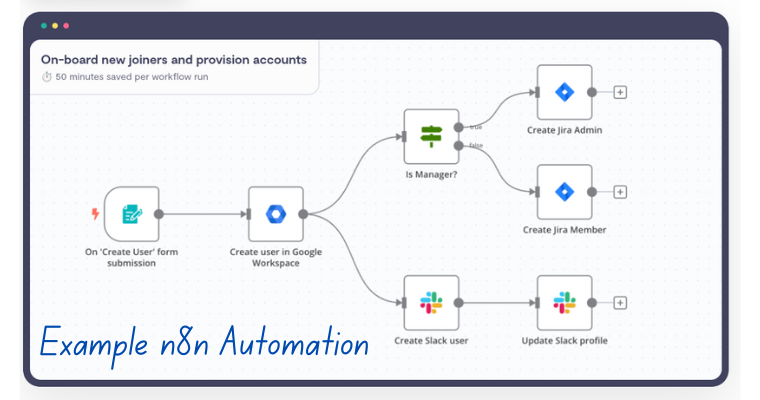
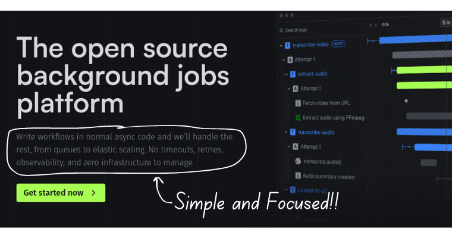
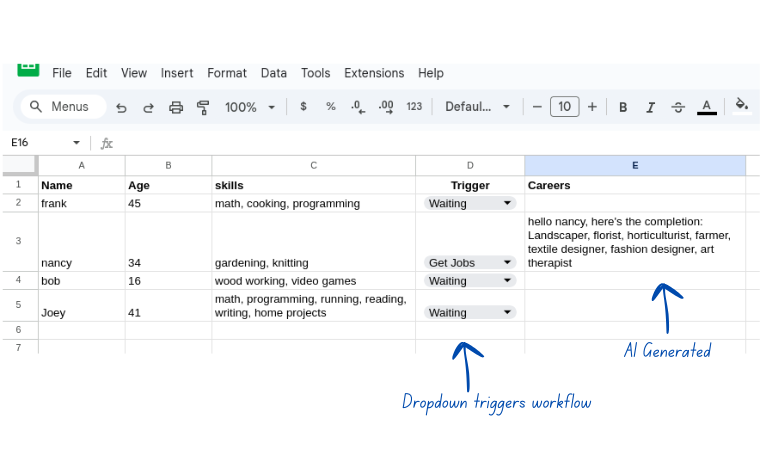
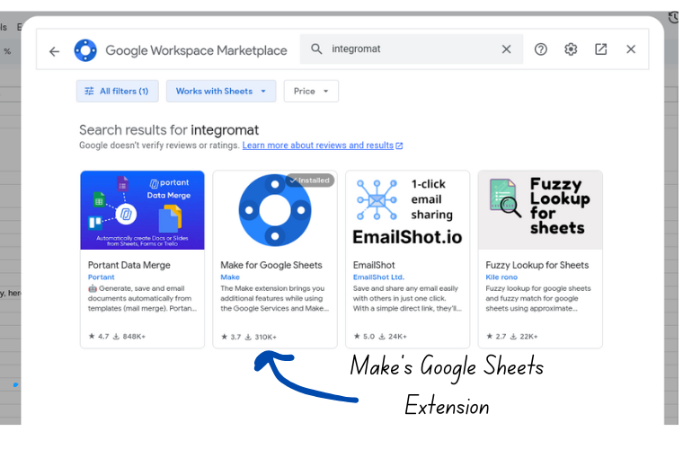
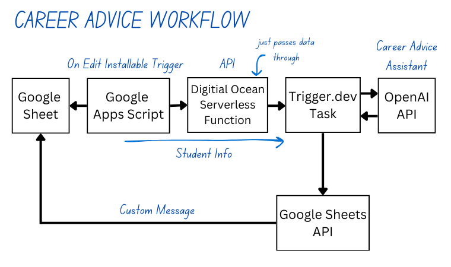
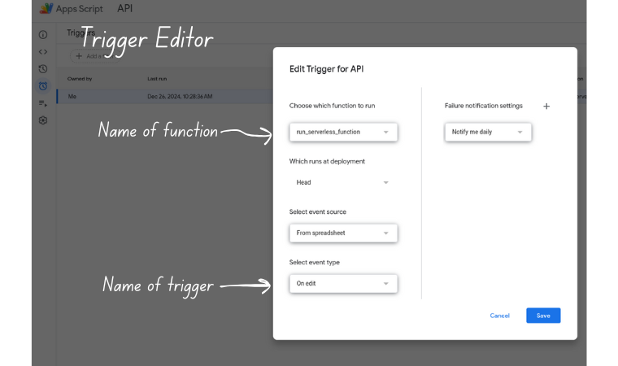
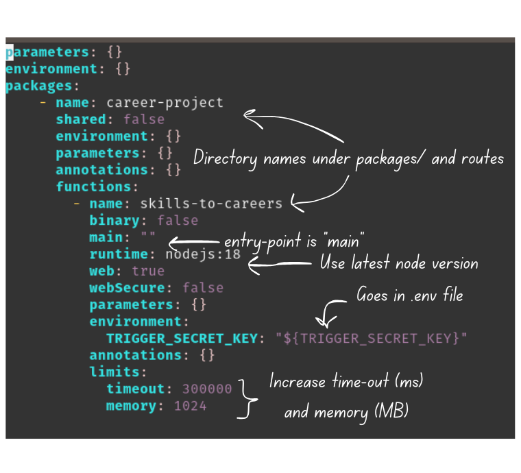

How do small businesses use modern technology to balance getting work done with lining up new work?  

I started investigating this question a couple months ago and learned a lot about business development and 
marketing in the process.  One of the trends that came up consistently was using generative AI and "workflow automation tools" to 
automate critical, but repetitive, business tasks.  Here's a list taken straight from the landing page for one of the most
popular automation products out there, [zapier](https://zapier.com):

* Sales handoffs
* Markeing campagins
* Data management
* IT helpdesk
* Lead Management
* Revops 

Even with no programming experience, people are able to build amazingly sophisticated software systems that have a major impact on their business's bottom line. 

Over the course of my career, I've used many different types of software products and tools.  None of them helped me automate a business task.  Sounds pretty good to me.  I appreciate the value of good business strategy, but I want to spend my time doing what I get paid to do - engineering.  If these tools can help me speed-up and codify even a small part of the business, then it's worth learning more.    

## What We'll Cover

In this post we're going to start out by

1. describing what workflow automation tools are,
2. discussing why "no-code" platforms may not be the right choice,
3. introducing a powerful open source alternative called [Trigger.dev](https://trigger.dev/)

After that, I'll use Trigger.dev, Google Sheets, and generative AI to build a proof-of-concept career advice system.

## What is a Workflow Automation Tool

Workflow automation tools let you build software systems by conveniently combining third-party APIs.  The most popular ones, like

* [make.com](https://www.make.com/en)
* [zapier](https://zapier.com/)
* [n8n](https://n8n.io/)

require no programming.  Instead, you design the workflows visually by dropping blocks onto a canvas and connecting them together. Like this: 


 
Some of the blocks implement simple programming constructs like logic or iteration.  Others, usually called "integrations", communicate with APIs.  To use an integration,  you just need to plug in your API credentials.

Obviously this is great for someone with a product idea but doesn't have the development experience to build it themselves.  It's also an efficiency booster for experienced programmers.  Working through API documentation might be interesting for awhile.  But at some point, your time is probably better spent doing something else.  These tools can give you some of your time back.            

## Experimenting with make.com 

As an experiment, I built a simple make.com (aka Make) "scenario" that uses an OpenAI assitant to convert old written content into short blog post drafts, and emails them on for review.  Everything is managed through a single Google Sheet.


Implementing this scenario was very easy.  The most tedious part was setting up Google crededentials.  But this isn't Make's fault; that's always a pain.

I have nothing bad to say about Make.  It's a fantastic service, it's just not the right tool for me.  I prefer programming over working a user interface, no matter how great it is.  Yep, programming takes more work.  But in return you get more power, more flexibility, and more independence.  

This last point is particulary important to me.  As an electrical engineer,  it's very easy to become a victim of "vendor lock-in".  Adopting software tools is unavoidable, but you don't want to become so dependent on them that you forget the fundamentals.  If you can afford the time, it's best to strive for a first-principles as much as possible.  Then you can jump around and use whatever tool you want.                     

Make simply doesn't conform to my "first-principles" philosophy, so I started looking into alternatives.  I was planning on giving n8n a try because is has a reputation for being geared toward software developers.  But then I came across [Trigger.dev](https://trigger.dev/).    

## Introduction to Trigger.dev 

Trigger.dev is much different than other popular automation solutions.  Instead of connecting blocks on a canvas, you implement workflows using their node package and normal Javascript.  You trigger the task from a separate application. There aren't any pre-built integrations.  If you want to connect to an API, you add the dependencies and write the code yourself.  

If you aren't getting a UI, and you're aren't getting integrations, what are you getting?    



Like their website suggests, you're getting a serverless deployment solution where you

> "Write workflows in normal async code and we'll handle the rest ..."

They've figured out a cost-effective way to containerize and execute long-running tasks on the web, without worrying about timeouts.  Time-consuming calculations,
multiple API calls, long-delays, and complex scheduling can all be expressed in code.  This opens up all sorts of possibilities that would be extremely difficult to implement in other serverless computing options.  No Function as a Service (FaaS) that I know of, will successfully run for longer than 15 minutes. Here's a list of popular options with their run-time limits:

* DigitalOcean Function: [15 minutes](https://docs.digitalocean.com/products/functions/details/limits/)
* Supabase Edge Functions: [150s-400s](https://supabase.com/docs/guides/functions/limits#runtime-limits)
* Vercel Functions: [15 minutes](https://vercel.com/docs/functions/runtimes#max-duration)
* AWS Lambda Functions: [15 minutes](https://docs.aws.amazon.com/lambda/latest/dg/gettingstarted-limits.html)

Based on these metrics, you won't be able implement an entire complex workflow in a single function.  What if you distributed the work between several functions?  Sure, you can do that, but this introduces more complexity.  Serverless functions can't be scheduled in code.  If you want to execute a function at some
time in the future, you'll need to modify a configuration file or database.  And even if you manage to nail the scheduling, you'll probably need to bring in a task queue to store data between functions.  

Trigger.dev handles all that extra complexity for you!

## What we're going to Build

We're going to build a proof-of-concept system that helps teachers give career advice to students based on information stored in a Google Sheet. 



You start by putting the student's name, age, and skills/interests in an open row.  When you're ready to get career advice, change the "Trigger" dropdown from "Waiting" to "Get Jobs".  A few seconds later, you'll get a list of possible careers for the student to consider.        

There are many ways to make this system more useful, accurate, and visually appealing.  I'll continue working on it.  My main objective here was to build something functional.

### System Architecture

If we used Make for this workflow, we'd only need to set up a few credentials, install the "Make for Google Sheets" extension, and connect up a few integrations.  Easy-peasy!



With Trigger.dev, we need to figure out a lot of the details ourselves: 

1. how to trigger an event from a Google Sheet,
2. how to send data from a Google Sheet to another webservice,
3. how to interact with the OpenAI API,
4. how to programatically update the Google Sheet 

After some research, here's what I came up with:


  
Changing the state of the dropdown from "Waiting" to "Get Jobs" triggers a Google Apps Script.  The script
takes the data from that row and sends it to a DigitalOcean Function that's waiting for requests at a 
particular URL.  The DigitalOcean Function does almost no work.  It's only purpose is to trigger a deployed Trigger.dev 
task with the spreadsheet data.  Think of it as a webhook.  Inside the task, the payload is destructured and integrated into
an OpenAI chat prompt.  Once the model's response is returned, the task uses the Google Sheets API to update the spreadsheet
with the career advice.

Yes, this workflow is simple enough that the whole thing could be put in the DigitalOcean function.  But if I want to 
extend the capabilities of this system later on, I'd rather get the right tools in place now.     

## Google Apps Scripts

Google Apps Scripts let you interact with Google Workspace products, like Google Sheets and Google Documents, in Javascript.
All you need to do is open up a Google Sheet, click the "Extensions" Tab in the top toolbar, and select "Apps Script".  This opens up an editor 
that lets you implement and test your "container-bound" script, setup triggers, and add credentials.           

For our career-advice system, we implemented a so-called "installable trigger".  With an "installable trigger", you write custom logic and attach it
to a trigger through the Trigger Editor.  "Simple triggers" let you bypass the Trigger Editor, but we can't use them because we'll need to hit an API
that requires authorization. 



Remember, we want to run the script when the "Trigger" dropdown transitions from "Waiting" to "Get Jobs.  This is a job for the "On Edit" trigger.  

The last thing we need to do is find a way to store credentials without revealing them in the Apps Script.  Once we set it up, we'll need to store the URL and authorization token for our DigitalOcean function.  The simplest way to do this is adding the key and value as a script property, and retreve the value in the script when you needed.  Very similar to creating an `.env` file.  Script properties are accessible under the "Project Settings" tab. 

## Configuring DigitalOcean Function Project

The Trigger.dev website covers several ways of triggering tasks from web frameworks and different serverless functions.  They don't talk about DigitalOcean's serverless function product, so I decided to try that.  Maybe someone using DigitalOcean will find it useful.  

We'll do everything with doctl, DigitalOcean's command line tool.  Instructions, including links to the official documentation are in my GitHub repository.

When you initialize a serverless function project with doctl you get a `project.yml` configuration file and a `packages/` directory.  The `packages/` directory contains everything you need for one "package" and one serverless function.  If you want more packages and/or more functions, just add more directories.  Chances are, you'll want to change the default package and function names.  No problem, just make sure that the new directory names match the package and function names in the `package.yml` file.  Otherwise your deployment will fail.  

Here's the `project.yml` file for my project:



It contains one package called `career-project` and one function in that package called `skills-to-careers`.  When I started working
on this, DigitalOcean only supported node versions 14 and 18.  To minimize compatibility issues, I went with 18. 

To be on the safe side, I maxed out the memory the function can use (1GB) and increased the timeout to 5 minutes.  Allocating this much memory to a function that does almost no work might seem a bit extreme.  For whatever reason though, during testing, executions failed because the function ran out of memory.  At least that's what the logs said.  Bumping it up fixed the issue.                        

I also added my Trigger.dev credentials to the function's environment section as a "template variable".  That way I can add `project.yml` to my git repository without sharing API credentials.  To get this to work, open up a `.env` file at the top-level of the project and add 

```sh
TRIGGER_SECRET_KEY=<add your secret key here>
```
Just make sure that you don't add `.env` to version control!  The `TRIGGER_SECRET_KEY` will be discussed in the next section.

DigitalOcean Functions use file-based routing, which means that the API routes match the directory layout.  Parameters submitted to a function's route are bundled with a bunch of http data, and passed as an object to the specified entry-point.  By default, the entry-point is a function named `main`.  If you need to change the entry-point for some reason, modify the function's `main` value in the `project.yml`.  I'm happy with `main` though.  The build process figures out which Javascript file contains the entry-point.  Moving forward, I'll call this the main function.   

The `skills-to-careers` function will need a few dependencies.  To prepare, I turned the `skills-to-career` directory into an npm package with an `npm init -y`.  Because I don't like source code and configuration files to be mixed together, I created a `src/` folder for all my Javascript files.  I moved the main function under `src/`, and made it the entry point for my npm package.

To be clear, there are two entry points: an entry point for the DigitalOcean Function, and an entry point for the npm package.  If you don't have both properly set, the serverless function will deploy but not work.

## Adding Trigger.dev

To use Trigger.dev, you first need to setup a Free account.  So far, I've been able to perform all my experiments without upgrading to one of the paid tiers.

The most important concept in Trigger.dev is the task.  You can think of a task as a special asynchronous function.  Every task gets attached to an Organization and Project that you first create in your Trigger.dev dashboard. 

I needed to create a Javascript-based task inside my DigitalOcean Function.  To do that, I navigated to the `skills-to-careers` folder and typed

```sh
npx trigger.dev@latest init --javascript
```

in the terminal.  This starts up a dialog that guides you through the project creation process: 

1. Asks you to select a project you created in the Dashboard. 
2. Installs the SDK and any other npm dependencies.
3. Creates a `trigger` folder with a sample task.
4. Creates a configuration file. 


### Why Javascript and not Typescript?

If you poke around the Trigger.dev docs, you'll get the impression that there's a strong preference for Typescript over Javascript.  Unfortunately, getting this to work with DigitalOcean Function's [48MB upload limit](https://docs.digitalocean.com/products/functions/reference/build-process/#control-which-build-artifacts-are-installed) required an ugly hack.  

The problem stems from how the DigitalOcean build process works.  According to the documentation, if a function folder has a `package.json` file with a `build` script, then `npm install` and `npm run build` runs.  On the other hand, if you don't have a `build` script, then `npm install --production` runs.  The key difference is

* `npm install` adds production and development dependencies to `node_modules`.       
* `npm install --production` doesn't add development dependencies to development dependencies.

Unless I'm missing something, I need a `build` script to convert Typescript files to Javascript.  This has the unfortunate consequence of blowing past the 48MB upload size constraint.     

My work around was manually switching between two `package.json` files; one for the DigitalOcean Function deployment, and the other for the Trigger deployment.    
The `package.json` for the Trigger deployment was the original one with all the dependencies.  For the DigitalOcean deployment, I removed all Trigger-specific dependencies from the `package.json`.  This did the trick, but I don't like this solution.  

Maybe I'll come up with something better, but until then, I'll stick with Javascript.  The workflow is so small, that I don't think Typescript is that beneficial anyway.    

### Adding Dependencies 

I added the OpenAI API and Google APIs Client as development dependencies.  Trigger bundles all dependencies anyway, and they won't be installed during the DigitalOcean deployment.  

## Deployment


## Conclusion