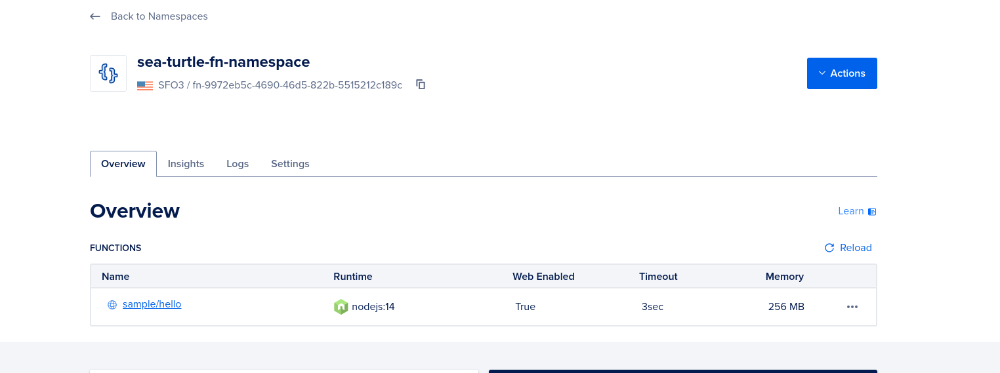

How can small businesses use modern technology to balance getting work done, and lining up new work?  I started investigating this 
question a couple months ago and learned quite a bit in the process.    

## What this Post will Cover


## No Code Automation Tools

No-code automation tools empower you to build software systems from APIs in a simple drag-and-drop interface.  As the name suggests, no programming necessary.  Obviously this is great for someone with a product idea, but can't build it themselves and can't justify paying a developer.  The tool is the developer.  

The 3 most popular no-code platforms on the market today are  

* [make.com](https://www.make.com/en)
* [zapier](https://zapier.com/)
* [n8n](https://n8n.io/)

So far, I've used make.com to build out a simple experimental system that uses generative AI (OpenAI models for now) to convert existing content into short blog post drafts and emails them on for review.  Everything was managed through a single Google Sheet.  Here's what the "scenario" looks like


Setting up this scenario was very easy.  The interface is extremely simple and well designed.  In fact, the hardest part was learning how to get make.com and Google to cooperate.  And even that was too tough, I just hadn't gone through the process before.

I have nothing bad to say about make.com.  It's a great tool, it's just not the right tool for me.  When you get right down to it, I'd rather write code
than navigate a user interface that does magical things in the background.

## Trigger.dev 

I was going to try n8n out because it's supposedly geared toward programmers, but then I came across [trigger.dev](https://trigger.dev/).  Trigger.dev is definitely not a no-code platform.  Instead of dragging, dropping, and connecting blocks on a canvas, workflows are build by writing typescript (or javascript).  You're responsible for bringing any npm packages you need, including the ones that help communicate with RESTful services.


## Digital Ocean Functions

Besides testing with their dashboard, there's no builtin way to trigger a task remotely.  You need to set up a webservice that trigger's the task when it receives a request.  The documentation does a good job of walking you through the process with a few different services and frameworks.  They don't specifically cover Digital Ocean's serverless functions, so I decided to try that.  


        
1. Install the `doctl` tools

2. Setup a namespace

3. Connect to the namespace

4. Initialize a project


### Digital Ocean

1. Create a namespace
```sh
doctl serverless namespaces create
```

2. Connect to namespace so we can add functions
```sh
$ doctl serverless connect
```

3. Create a javascript project, which will be deployed in that namespace

```shell
$ doctl serverless init --language js doctl-trigger-dot-dev
A local functions project directory 'doctl-trigger-dot-dev' was created for you.
You may deploy it by running the command shown on the next line:
  doctl serverless deploy doctl-trigger-dot-dev
```


```shell
$ doctl serverless deploy doctl-trigger-dot-dev
Deploying '/home/joeyreed/Documents/GITHUB/doctl-trigger-dot-dev'
  to namespace 'fn-9972eb5c-4690-46d5-822b-5515212c189c'
  on host 'https://faas-sfo3-7872a1dd.doserverless.co'
Deployment status recorded in 'doctl-trigger-dot-dev/.deployed'

Deployed functions ('doctl sls fn get <funcName> --url' for URL):
  - sample/hello
```

```shell
$ doctl serverless function list
Latest Update     Latest Version    Runtime Kind    Function Name
12/16 05:45:31    0.0.1             nodejs:14       sample/hello
```

```sh
$ doctl serverless function invoke sample/hello
{
  "body": "Hello stranger!"
}
```

```sh
doctl-trigger-dot-dev/packages/sample/hello$ npx trigger.dev@latest init
```

```sh
doctl-trigger-dot-dev/packages/sample/hello$ npm install -D vite
```




[node instructions](https://docs.digitalocean.com/products/functions/reference/runtimes/node-js/)


## Trigger.dev

[Trigger.dev](https://trigger.dev/) is a newer automation tool 

### Triggers in Google Sheets


```sh
curl -d '{"key1":"value1", "key2":"value2"}' -H "Content-Type: application/json" -X POST API_URL
```

```sh
curl -X POST "https://<your-server>.doserverless.co/api/v1/namespaces/<your-namespace>/actions/sample/hello?blocking=false" \
  -H "Content-Type: application/json" \
  -H "Authorization: <your-token>"
```

For some reason, I can can run the url fetcher in Google App Script without the authorization token.  It doesn't work when I run the cURL command in the terminal.  Expects authorization.  Weird.


To run the post request asynchronously, add special parameter to post request ...

```js 
const obj = UrlFetchApp.fetch(`${api_end_point}?blocking=false`, options);
```

What connects a deployment to an application in trigger?

When I re-deploy my function, I can't seem to trigger, trigger. Why?

Put "exclude" in tsconfig.json file.  Put the trigger config there ...

Import my task as a type, 
```js 
import type { digitial_ocean_task } from "./trigger/example";
```

```sh
npx trigger.dev@latest deploy
```
```sh
curl -d 'name=Sammy' https://faas-sfo3-7872a1dd.doserverless.co/api/v1/web/fn-9972eb5c-4690-46d5-822b-5515212c189c/sample/hello
``````


Google Stuff:
1. Installable trigger in Google Appscript to trigger DO function
2. Store digital ocean auth info in "Script Properties" of AppScript DashBoard.
3. Google Cloud project using API to communicate back to spreadsheet.  Need to setup a project, enable Google Sheets API in that project.  Use Service Project style authorization with a JWT (JSON Web token)


Got tyypescript compilation errors in the trigger.dev file.  Added annotation at top of file.  The issues were related to the google sheets API.

Error: While deploying action 'sample/hello': 413 Payload Too Large.  Isn't there supposed to be some sort of tree shaking or something?
Remember, it worked before, is it because the dependencies are getting added?  Yes. I ended up removing the dependencies required for the trigger task, manually.
This seems too weird and wacky.  Is this because we want all the tasks used for trigger to be devdependencies ?  

Need to run typescript, and then not install dependencies ...

I think the better option is to separate the trigger task from the backend task that "calls" it.  The backend code doesn't need any typescript.  The SDK can 
call the task via id alone...
