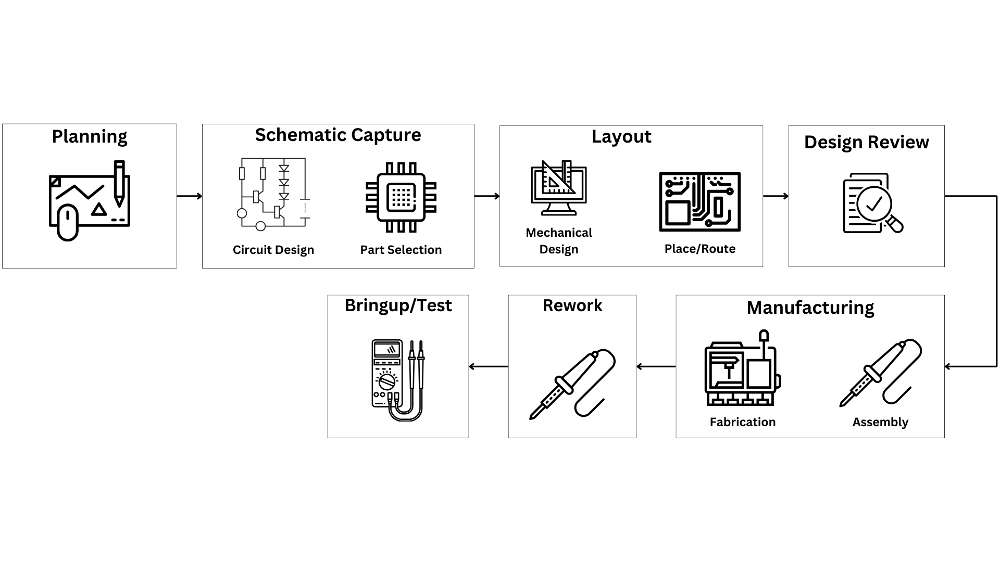

I don't think it's hyperbole to claim that digital communications has impacted nearly every aspect of life on Earth.  It's so ingrained in daily life that it's easy to take it for granted.  You might even say it's boring. I'm starting a series of posts that will delve a little deeper into the world of digital communications.  I'm going to describe some of the scientific and engineering magic behind it, and explain how it could broaden your technical know-how .  It's chock-full of algorithms, problem-solving strategies, mathematical techniques, theory, and physical principles that can be used in pretty much any technical discipline.

## Focus on the Channel

The goal of any communication system is to accurately transfer information from a transmitter to a receiver, through a communication channel.  Pretty much anything can be a communication channel - the atmosphere, outer space, cables, even the human body.  Each channel has it's own unique quirks that make it easier or harder to communicate through.  It's ultimately these channel-specific quirks that determine how to best shape your signal energy to effectively propagate through the channel.

Some channels have have very well-known properties, while others are a bit more mysterious.  Computational models that accurately capture the statistics of a channel are extremely valuable in the design process.  If you do it right, you can plug the channel model right into your system simulator and get all the algorithms properly tuned before starting the production implementation.  This is a huge time saver!     

## Budgeting

Here's the practical goal: figure out how to design the best performing system, at the lowest possible cost, without violating any government regulations.  Like most things in engineering, there is no perfect solution, only tradeoffs.  The financial budget and link budget help manage these tradeoffs.

### The Financial Budget

Project costs need to be allocated and managed carefully.  Otherwise, it's easy to spend your entire budget before hitting all the milestones.  Let's say the system your building needs a custom printed circuit board (PCB).  You'll need to design the board, select and purchase components, and get a PCB manufacturer to fabricate and populate the board. Here's a summary of a PCB design workflow:

Lot of steps right?  PCB design is a very expensive, time consuming, error-prone process.  The professional design tools help, but there's no substitute for detailed design reviews.  If you and your team are very meticulous, it's possible to get a fully functioning board back from the manufacturer .  But let's just say it's not unusual to make an error or two during schematic capture or layout.  And unlike software work, you generally can't fix hardware bugs with a button-push or recompilation.  To be on the safe side,  it's wise to include a little extra in the budget to cover the cost of rework.     
     
Poor component selection can also severly hurt your budget.  Most board builds require hundreds of passive resistors, capacitors, and inductors.  Resistors are used in all sorts of circuits: current limiters, voltage dividers, analog filters, current-sense circuits, etc.  Some of these circuits require very precise resistance values, and some don't.  Unless something about the design requires an extremely accurate current measurement, there's generally no need to go beyond a precision of 1%.  Why?  Precision costs money.  I just went on [Digikey](https://www.digikey.com/) (a major electronics distributor) and found two resistors with the same resistance value, temperature rating, power rating, and dimensions, but different tolerance grades (1% and 0.01%).  The 1%-rated resistor is $0.10 and the 0.01%-rated resistor is $2.00.  Multiply that by a few hundred resistors, and you'll quickly see the impact. 

But wait, won't poorer quality components lead to poorer performing hardware?  Possibly.  It's more likely that big precision gains will just get lost in the noise.  When in doubt, you can always run simulations to estimate the worst case.  If the worst case scenario still hits the performance goal (with enough margin), you're good to go.  

### The Link Budget

Before hardware, software, and communication engineers start implementing, the systems engineers need to decide what to build.  This is where the link-budget comes in.  Think of a link budget as a spreadsheet that documents a very high-level system design.  It records the estimated gains and losses a communication signal is expected to undergo as it is synthesized in the transmitter, propagated through the channel,  and detected at the receiver. Estimates can come from physical models, simulation, or mathematical analysis.  It depends on the data you have access to.    

There's no hard-and-fast rule about what needs to be included in the link budget.  You can include as much, or as little, detail as the project demands.  It just needs to be granular enough to guide the design process.  A well-crafted link budget tells you whether or not the design will meet the design goals.    

The *link margin* is the difference between the link-budget's total gains and total losses.  To account for suboptimal implementation, you should generally aim for the largest link-margin you can get away with.  When the systems engineer thinks the link-margin is large enough (aka "the link is closed"), it's probably safe to start implementing.  If the link is not closed, the design must be thoughtfully adjusted until it is.    

When the link is closed and everyone is happy with the high-level plan, the link-margin is divided up amongst the different engineering teams on the project.  The portion of the link-budget you get is the amount your contribution is allowed to stray from the optimal solution or algorithm. If your working on a very difficult subsystem, you're likely to get a bigger piece of the link-margin pie.

## Wrap it up

This was a quick tour of what goes on during the early stages of a communication design.  Like most engineering tasks, success depends on a few basic principles:

1. Understanding the goal
2. Understanding the technical challenges
3. Understanding the costs

We'll delve into these topics in detail, in upcoming posts.

