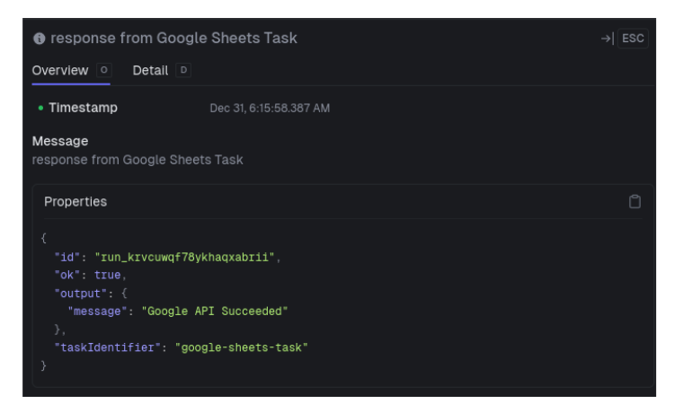

How can small businesses leverage modern technology to boost productivity and amplify market reach?

I started investigating this question a couple months ago.  One of the trends that came up consistently in my research was the use of generative AI and "workflow automation tools" to automate critical business tasks.  Here's a list of some use cases taken straight from the landing page for one of the most
popular automation products, [zapier](https://zapier.com):

* Sales handoffs
* Marketing campagins
* Data management
* IT helpdesk
* Lead Management
* Revops 

Even with no programming experience, people are able to build amazingly sophisticated and useful software systems that have a positive impact on their business's bottom line. 

Over the course of my career, I've used many different software products.  Not one has helped me with a business task.  This started sounding pretty appealing.  I want to spend my time doing what I get paid to do - engineering.  If these tools can help me codify and reduce the time I spend on some business process, then it's worth giving them a try.

## What We'll Cover

In this post we're going to 

1. describe what workflow automation is,
2. discuss why "no-code" platforms may not be the right choice,
3. introduce a powerful open source alternative called [Trigger.dev](https://trigger.dev/)

After that, I'll describe how I used Trigger.dev, Google Sheets, and generative AI to build a proof-of-concept career advice system.

## What is a Workflow Automation Tool

Workflow automation tools let you build software systems by combining third-party APIs.  The most popular ones, like

* [make.com](https://www.make.com/en)
* [zapier](https://zapier.com/)
* [n8n](https://n8n.io/)

require little to no programming.  Instead, you design workflows visually by dropping blocks onto a canvas and connecting them together. Like this: 


 
Some of the blocks implement simple programming constructs like boolean logic or iteration.  Others, usually called "integrations", communicate with APIs.  To use an integration, you just need to plug in your API credentials.

Obviously this is great for someone with a product idea but doesn't have the development experience to build it.  But it can also be an efficiency boost for experienced programmers.  Working through API documentation might be interesting for awhile.  But at some point, your time is probably better spent doing something else.  These tools can give you some of your time back.            

## Experimenting with make.com (aka Make)

In Make, workflows are called "scenarios".  For my first foray into automation, I built a simple scenario that used an OpenAI assitant to convert old written content into short blog post drafts, and emailed them on for review.  Everything was managed through a single Google Sheet.  Here's what the scenario looked like in the Make dashboard:


Implementing this was very easy.  The most tedious part was setting up my Google credentials.  Even that wasn't hard, just unfamiliar.  You end up having to access your Google Cloud account, which I hadn't done before.

### Why No-Code is not my Ideal Choice 

I have nothing bad to say about Make.  It's a fantastic service, it's just not the right tool for me.  I prefer programming over working a user interface, no matter how great it is.  Programming takes more work, but in return you get more power, more flexibility, and more independence.  

This last point is particulary important to me.  As an electrical engineer,  it's very easy to become a victim of "vendor lock-in".  Adopting software tools is unavoidable, but you don't want to become so dependent on them that you forget the fundamentals.  If you can afford the time, it's best to strive for a first-principles as much as possible.  Then you can jump around and use whatever tool you want.                     

Make simply doesn't conform to my "first-principles" philosophy, so I started looking into alternatives.  I was planning on giving n8n a try for several reasons, but then I came across [Trigger.dev](https://trigger.dev/).    

## Introduction to Trigger

Trigger is much different than other popular automation solutions.  

* Instead of connecting blocks on a canvas, workflows are expressed in Javascript and/or Typescript code.
* Integrations aren't included.  To communicate with APIs,  you need to add the appropriate dependencies and write the code yourself.   

If you aren't getting drag-and-drop functionality, and you're aren't getting built-in integrations, what are you getting?    


Like their website suggests, you're getting an optimizes deployment experience where you

> "Write workflows in normal async code and we'll handle the rest ..."

They've figured out a cost-effective way to package and execute long-running tasks on the web, without worrying about timeouts.  Time-consuming calculations,
multiple API calls, long-delays, and complex scheduling can all be expressed in code.  This opens up all sorts of possibilities that would be extremely tricky to implement with other serverless computing options.  No Function as a Service (FaaS) that I know of, will successfully run for longer than 15 minutes. Here's a list of popular options with their run-time limits:

* DigitalOcean Function: [15 minutes](https://docs.digitalocean.com/products/functions/details/limits/)
* Supabase Edge Functions: [150s-400s](https://supabase.com/docs/guides/functions/limits#runtime-limits)
* Vercel Functions: [15 minutes](https://vercel.com/docs/functions/runtimes#max-duration)
* AWS Lambda Functions: [15 minutes](https://docs.aws.amazon.com/lambda/latest/dg/gettingstarted-limits.html)

There are cetainly systems you might want to design that could take longer than 15 minutes.  For example, you might want to schedule a workflow to execute every day at 8:45am.  You can do this with serverless functions, but you'll be forced to either add the schedule to a database or a configuration file.  You can't do it in code.  In Trigger you can!  

To get around the timeout constraint, you might be forced to distribute the work you'd like to do in one serverless function, over several.  Now you'll probably have to bring in a task queue, or some other way to manage state between function calls.  This introduces a lot of complexity that you may not have the time, or expertise, to deal with.  Trigger.dev handles all the extra complexity for you!
 

## What we're going to Build

We're going to build a proof-of-concept system that offers career advice to students based on information stored in a Google Sheet. 


You start by putting the student's name, age, and skills/interests in an open row.  When you're ready to get career advice, change the "Trigger" dropdown from "Waiting" to "Get Jobs".  A few seconds later, you'll get a list of carrer paths that leverage those skills.         

There are many ways to make this system more powerful and visually appealing.  I'll continue working on it.  My main objective for now was to build something functional.

### System Architecture

If I used Make for this workflow, I'd only need to set up credentials, install the "Make for Google Sheets" extension, and drag in couple of integrations.  Easy-peasy!


With Trigger, I needed to figure out a lot of the details myself: 

1. how to trigger an event from a Google Sheet,
2. how to send data from a Google Sheet to an API,
3. how to interact with the OpenAI API,
4. how to programatically update a Google Sheet with an API 

Here's what I came up with:


  
The spreadsheet uses 3 separate sheets:

1. **Students Sheet**: Includes student details like name, age, skills and interests.  In this application, the user prompt is the student's skills and interests.
2. **Prompts Sheet**: Contains system prompts that instruct the LLM how to behave and what to produce when given a user prompt.  Including in the spreaadheet, and not hardcoding it API calls will let me change system behavior much more faster.  
3. **Models Sheet**:  Contains a list of open and closed course LLMs available from companies like [OpenAI](https://openai.com/), [Together.ai](https://www.together.ai/), and [Groq](https://groq.com/) .  Right now, I'm exclusively using OpenAI's inexpensive `gpt-4o-mini`.  But I can imagine wanting to see how well different models perform this career-advice task. 

When the state of the student's dropdown changes from "Waiting" to "Get Jobs", a Google Apps Script triggers.  The script packages up information in the different Google sheets, including 

* Sheet ID
* Sheet name
* Target cell that I want the career advice to go
* Student's name
* Student's skills and interests
* System prompt
* Name of the LLM model

and posts it to the main task's API URL.  When the main task receives the packet, the work gets divided into two tasks

1. **OpenAI task**:  queries the LLM for career advice
2. **Google Sheets task**: post the career advice back to the originating Google Sheet

More details, including some of the source code, will show up later.
  
## Setting up API Credentials

You'll need to set up credentials for every service your automation needs.  For me that means OpenAI and Google.  This is probably the least exciting part of this post, but if you want your system to work, you need to get it right.  

### OpenAI

Getting an OpenAI API Key is extremely simple:

1. Sign into your account.
2. Click the "API Keys" tab on the left side of your dashboard
3. Press the "Create new secret key" button.
4. Give the API Key a name, permissions, and connect it to a project.
5. Copy the API key and keep in somewhere safe.  You won't be able to get access to it again, though you can always create a new one. 


### Google Service Account

Setting up Google credentials is a long, annoying process.  First thing you need to do is create a Goolge Cloud Platform project. 

1. Sign into Google Cloud Platform with your Google account.
2. Create a project.      
3. Navigate to the API Library page and enable the Google Sheets API.  You can get to this page by clicking the main navigation menu at the upper left of the page and selecting "APIs and Services".  Press the "Enable APIs and Services" button along the top of the page.  

Now you need to create the user managed service account.  Service accounts execute actions, like API requests, on your behalf.  

1. Get back to the APIs and Services Tab.
2. Select the Credentials tab along the left hand side.
3. Click the "Manage service accounts" link above above the "Service Accounts" listing.
4. Press the "Create Service Account" button toward the top of the Service Accounts window.
5. Give the service account a name and an ID.  Press the "Create and Continue" button.
6. Select the "Editor" role for this project.  Press the "Continue" button.
7. You don't need to grant users access to the account.  Press the "Done" button.

This last step brings you to a listing of all your user managed service accounts.  You need to generate your authorization credentials.

1. Click the email for the service account you just created.
2. Select the "Keys" tab along the top of the service account page.
3. Press the "Add Key" drop down.
4. Select the JSON recommendation.

This last step will generate your JSON web token (JWT) and download it to your machine.  Put it in a safe place, you'll need to use it later.  You won't be able to get a copy of this file again, but you can always generate a new one.  Feel free to open it up and take a look, just don't let anybody else see it.  In addition to some basic information about your service account, including its email address, it has your private authorization key.

The final thing you need to do is give your service account permission to access to edit your Google Sheet.  You do this by going to your Google Sheet, pressing the "Share" button in the top right, and enter the email address for your service account.


## Getting Started with Google Apps Script

Google Apps Scripts let you interact with Google Workspace products, like Google Sheets and Google Documents, in Javascript.  To attach one to a Google Sheet, open up a Google Sheet, click the "Extensions" Tab in the top toolbar, and select "Apps Script".  This opens up an editor that lets you implement and test your so-called container-bound script, setup triggers, and add credentials.           

I needed to write a Google Apps Script that

1. can get information about my sheet including cell values and sheet names, and
2. send that information to the endpoint for my Trigger task

whenever the "Trigger" column was edited.  Because the Trigger API requires an authorization header, I used an "installable trigger".  With an installable trigger you use the editor to manually attach an event to the function you want to run, when that event occurs.  It's just like a callback.


The "On Edit" event is the right choice for this application.  To avoid hitting the API when irrelevant cells were modified, I added a little extra logic.

I also needed a way to store my Trigger credentials in the Apps Script project without revealing them in the source code.  One of the recommended approaches is adding them to the Script Properties key-value store available under the Script Properties tab.  Once they're stored, the credentials are accessible in the Apps Script through the `PropertiesService` class.

## Creating a Trigger Project

Start by setting up a free Trigger account. Chances are, you won't need one of the paid tiers right away, unless you're building something really ambitious.  

The Free tier gives you access to as many tasks, projects, and organizations as you want.  It's pretty clear what a task is.  Organizations and projects are account mechanisms, added through the Dashboard, to keep track of your tasks.  They help keep your dashboard clean and tidy.  Every Trigger codebase must be attached to a project created under an organization.  

### Creating an Orgaization and Project 

Before initializing my Trigger codebase, I created an organization called "Career Assistant" and a project called "google-sheets-workflow".  You can delete organizations and rename project names, but you can't delete projects.      

### Initializing the Codebase 

First, I initialized an npm package and adding the OpenAI API and Google APIs Client as dependencies:  

```sh
mkdir my-trigger-project
cd my-trigger-project
npm init -y
npm install openai googleapis
```  

Once the dependencies were installed, I added Trigger by running the CLI initialization command:

```sh
npx trigger.dev@latest init 
```

No need to install their CLI tool - `npx` handles everything for you.  

This starts up a dialog that helps scaffold out a project:  

1. Asks you which Trigger project you want to attach your future tasks to.

2. Installs the SDK and any other npm dependencies.

3. [Optional] Creates `src/trigger` directory with sample task

4. Creates a `trigger.config.ts` configuration file. 

The configuration contains the autogenerated project ID associated with the project and organization previously set up.   

### Adding Credentials

Each project has its set of environment variables for storing API credentials and other sensitive data you don't want to reveal in source code.  You add them under the "Environment variables" tab as key/value pairs.  They're accessed in your source code like environment variables in any other Node project, with `process.env`.  

I added my OpenAI key and my Google Service Account JWT. 

It wasn't immediately obvious how to store the JWT as an environment variable  Fortunately, Trigger's website has a straight forward [solution](https://trigger.dev/docs/deploy-environment-variables#using-google-credential-json-files).  They recommend using the base64 encoding of the JWT as your Google credential.  In task code, you convert the Base64 encoding back to a Javascript object 

```js 
const jwt = JSON.parse(
  Buffer.from(process.env["GOOGLE_CREDENTIALS_BASE64"], "base64").toString("utf8")
);
```
and pass the object into the function that authorizes your service account to edit Google Sheets.

```js
const googleAuth = new google.auth.GoogleAuth({
  credentials: jwt,
  scopes: ["https://www.googleapis.com/auth/spreadsheets"],
});

```

### Organizing Tasks 

My workflow was simple enough that I could have implemented the whole thing in a single task.  To make testing a little bit easier, I decided to split it up into one root task and two subtasks - one per API.  Even though this could theoretically bump up my usage bill, I'll still be nowhere near exceeding the Free tier's $5 monthly allowance.

Here's the "root" task code that invokes my `openai_task` and `google_sheets_task`:  

```js
export const career_advice_task = task({
  id: "career-advice",

  run: async function (payload: any, { ctx }) {

    // Just Grab the response
    let chatResponse = await openai_task.triggerAndWait( payload ).unwrap();

    let googleResponse = await google_sheets_task.triggerAndWait({
      ...payload,
      chatResponse
    })

    logger.info("response from Google Sheets Task", googleResponse);

    return {
      message: "Done With Career Advice"
    }
  }
});
```
Calling `triggerAndWait` is the recommended way to call a task when you want to pass the output to another task.  It starts the task, waits until it finishes,  and returns a result object containing the task output, the completed run id, the task id, that a status flag.  Here's an example from my Trigger log for the Google Sheets task:



The `unwrap` method strips out the output value from the result object and throws the metadata away.


The subtasks are equally straight forward.  Here's the Google Sheets task

```js
const jwt = JSON.parse(
  Buffer.from(process.env["GOOGLE_CREDENTIALS_BASE64"], "base64").toString("utf8")
);

const googleAuth = new google.auth.GoogleAuth({
  credentials: jwt,
  scopes: ["https://www.googleapis.com/auth/spreadsheets"],
});


export const google_sheets_task = task({
  id: "google-sheets-task",

  run: async function({sheetId, sheetName, targetCell, studentName, chatResponse }: any) {

    const googleClient = await googleAuth.getClient();

    const sheets = google.sheets({version: "v4", auth: googleClient});

    let result = await sheets.spreadsheets.values.update({
      spreadsheetId: sheetId,
      auth: googleClient,
      range: `${sheetName}!${targetCell}`,
      resource: { 
        values: [[`Hi ${studentName}, here are some careers to look into: ${chatResponse}`]]
      },
      valueInputOption: "USER_ENTERED"
    });

    logger.info("Inside Google Sheets Task", result);

    if (result?.status !== 200) {
      throw new Error("Google API Failed");
    }
    return {
      message: "Google API Succeeded"
    };

  }
});
```

and the OpenAI task

```js
/*
  OPEN AI TASK
*/
const openai = new OpenAI({
  apiKey: process.env["OPENAI_API_KEY"], // This is the default and can be omitted
});

export const openai_task = task({
  id: "openai-task",

  run: async function({systemPrompt, userPrompt, model}: any) {
    const chatCompletion = await openai.chat.completions.create({
      messages: [
        { role: "system", content: systemPrompt},
        { role: "user", content: userPrompt }
      ],
      model: model,
    });

    logger.info("Chat completion", chatCompletion);
    // Deal with Error Case too .
    const chatResponse = chatCompletion?.choices[0].message.content;
  
    logger.log("Chat Completion", { chatResponse });

    if ( chatResponse === undefined ) {
      throw new Error("OpenAI failed answer request!");  
    }
    return chatResponse ;
  }
});
```

For simplicity, I'm honestly thinking of getting rid of the API-specific libraries and just using Node's built in `fetch` API.  Besides reducing the number of dependencies (always a good thing if you can manage it), it will also make my code more flexible.  Like I said earlier, I'd eventually like to use LLMs from organizations other than OpenAI.  While many of them top companies offer OpenAI-compliant APIs,  I don't want to necessarily rely on that continuing indefinitely.  


### Deployment

The Free tier offers Development and Production environments for projects.  The development environment lets you build and run your tasks locally before deploying them to a hosted service.  It can come in handy, but I went straight for production.  Here's how you do it:

```sh 
npx trigger.dev@latest deploy
```

After a few minutes, you'll see your deployed tasks in the Dashboard.  From there, you can test each task individually with custom payloads:


If you find a bug, no big deal.  Just fix it and deploy again. 

## Finishing Up

Working on it.

## Conclusion

Working on it.
